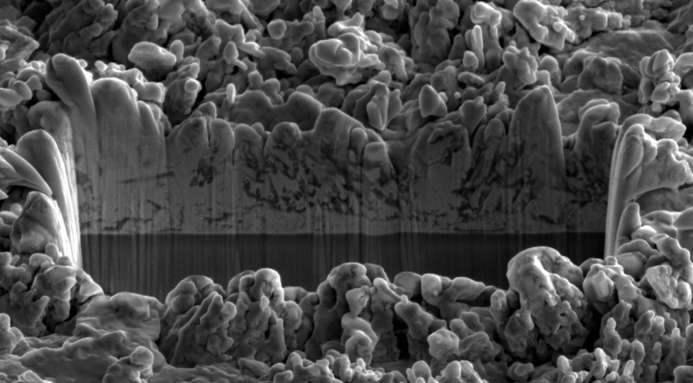
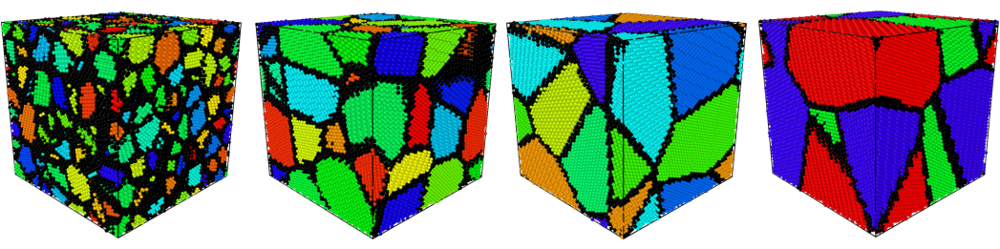
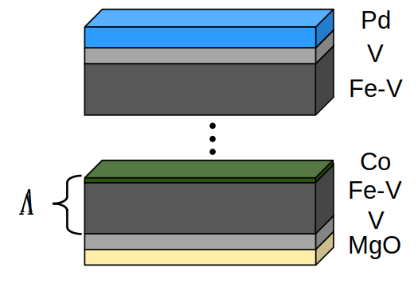
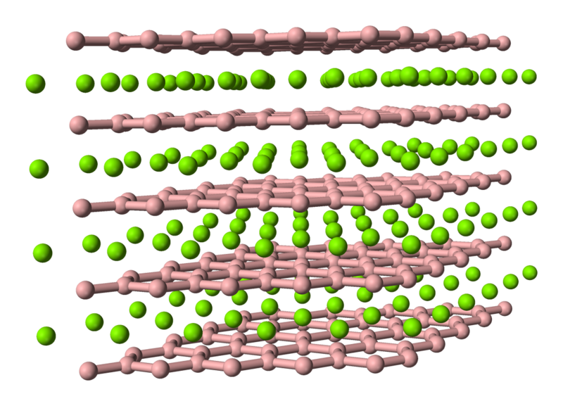

# My papers and theses
My academic papers and theses from my time as a Materials Science &amp; Engineering Researcher.

## Content
1. [Peer-reviewed publications](#peer-reviewed-publications)
2. [Master of Science Thesis](#master-of-science-thesis)
3. [Graduate Seminar Thesis](#graduate-seminar-thesis)
4. [Graduate Research Project Report](#graduate-research-project-report)
5. [Bachelor of Science Thesis](#bachelor-of-science-thesis)

## Peer-reviewed publications

- [*Self-passivating (Re,Al)B2 coatings synthesized by magnetron sputtering*](https://www.nature.com/articles/s41598-018-34042-1)  
P. Bliem, S. Mráz, S. Sen, O. Hunold, J. M. Schneider  
**Sci. Rep. 8 (2018) (open access)**

- [*Remote Tracking of Phase Changes in Cr2AlC Thin Films by In-situ Resistivity Measurements*](https://www.nature.com/articles/s41598-019-44692-4)  
B. Stelzer, X. Chen, P. Bliem, M. Hans, B. Völker, R. Sahu, C. Scheu, D. Primetzhofer & J. M. Schneider  
**Sci. Rep. 9 (2019) (open access)**

- [*Elastic properties of amorphous T0.75Y0.75B14 (T = Sc, Ti, V, Y, Zr, Nb) and the effect
of O incorporation on bonding, density and elasticity (T = Ti, Zr)*](https://iopscience.iop.org/article/10.1088/1361-648X/aa5375/pdf)  
O. Hunold, P. Keuter, P. Bliem, D. Music, F. Wittmers, A. L. Ravensburg, D. Primetzhofer and J. M. Schneider  
**J. Phys.: Condens. Matter 29 (2017)**

- [*Theoretical study of deposition-induced point defects in ZnO*](https://www.sciencedirect.com/science/article/abs/pii/S0257897216313172)  
D. Music, L. Offermann, G. Aras, P. Bliem, M. Geilen, Y. Naunheim and T. Ravindra  
**Surf. Coat. Technol. 309 (2017)**

- [*Atomistic growth phenomena of reactively sputtered RuO2 and MnO2 thin films*](https://aip.scitation.org/doi/abs/10.1063/1.4926414)  
D. Music, P. Bliem, R. W. Geyer, and J. M. Schneider  
**J. Appl. Phys. 118 (2015)**

- [*Amorphous-crystalline transition in thermoelectric NbO2*](https://iopscience.iop.org/article/10.1088/0022-3727/48/27/275301/meta)  
D. Music, Y.-T. Chen, P. Bliem, and R. W. Geyer  
**J. Phys. D: Appl. Phys. 48 (2015)**

- [*Holistic quantum design of thermoelectric niobium oxynitride*](https://www.sciencedirect.com/science/article/pii/S0038109815001131)  
D. Music, P. Bliem, and M. Hans  
**Solid State Commun. 212 (2015)**

- [*Vacancy filling effect in thermoelectric NbO*](https://iopscience.iop.org/article/10.1088/0953-8984/27/11/115501/meta)  
D. Music, R. W. Geyer, P. Bliem, M. Hans, and D. Primetzhofer  
**J. Phys.: Condens. Matter 27 (2015)**

- [*Modulation of transport properties of RuO2 with 3d transition metals*](https://iopscience.iop.org/article/10.1088/2053-1591/1/4/045034/meta)  
D. Music, Y.-T. Chen, R. W. Geyer, P. Bliem, and J. M. Schneider  
**Mater. Res. Express 1 (2014)**

## Master of Science Thesis

***Synthesis and Characterization of Re-B Thin Films*** [[pdf]](./MSc_Thesis_PascalBliem.pdf)

***Abstract:*** In this work, Re-B and Al/Ti-alloyed Re-B thin films are deposited by hybrid RF-DC magnetron sputtering. The phase formation, chemical composition and state, and mechanical properties of the films are characterized by XRD and SEM, EDX and XPS, and nanoindentation, respectively. Phase-pure ReB2 films are synthesized between 500 and 900 °C over a wide composition range of about 55 to 75 at.% B. Al and Ti can be alloyed into ReB2 films without formation of other phases up to concentrations of 13.6 at.% Al and 3.9 at.% Ti, respectively, which agrees excellently with predictions from the energies of formation obtained by DFT calculations. Unalloyed ReB2 films exhibit an elastic modulus of about 500 GPa and a hardness of about 30 GPa. These comparably low values (cf. EDFT=667 GPa) can be rationalized by the rough, inhomogeneous, and apparently porous microstructure of the films. Upon Al-alloying, the films become rougher, more porous, and less stiff and hard. However, one exceptionally smooth and dense Al-alloyed film (3.5 at.% Al) exhibits high stiffness and superhardness (E=562 GPa, H=40 GPa). Upon Ti-alloying, the films show much lower surface roughness and no indication of porosity, which yields high stiffness and superhardness with E and H up to 519 and 40 GPa (12.7 at.% Ti), respectively. Unalloyed ReB2 films form perrhenic acid (HReO4) in air, indicating coating corrosion. Ti-alloyed films form TiO2 which slows down the corrosive reaction, but does not seem to result in full passivation. Al-alloying, on the contrary, results in the formation of a passivating Al2O3 layer which prevents a corrosive reaction already at an Al concentration of 3.7 at.%. Thus, it is shown that superhard and chemically stable (Re,Al)B2 coatings can be synthesized by magnetron sputtering.

## Graduate Seminar Thesis

***Computational and experimental investigation of the grain size dependency of the thermal expansion of Nb thin films*** [[pdf]](./Graduate_Seminar_Thesis.pdf)

*Co-authors: Oliver Beyß, Fatim-Zahra Mouhib*

***Abstract:*** Several studies reported a grain size-dependent thermal expansion in nano-crystalline materials, which is commonly attributed to the large amount of atoms located in grain boundaries (GBs). This effect can be of technological interest, since it may allow for tuning the thermal expansion coefficient. However, the reported magnitude of this effect varies strongly in literature and is most likely influenced by additional microstructural sample features, besides GBs.  
In this work, we study grain size-dependent thermal expansion at the examples of Nb and Cu with different computational approaches, and create a foundation for an experimental investigation of this effect in Nb thin films. Molecular dynamics simulations of Cu systems with GB fractions ranging from 0 to 58.2% show an increase in the linear thermal expansion coefficient, αL , of 8.7%. In contrast, Nb systems with GB fractions ranging from 0 to 67.5% show an overall decrease in αL of 3.7%, while over a temperature range from 100 to 300 K, an increase in αL of about 5% is still observed. Ab initio density functional theory simulations in conjunction with the Debye-Grüneisen model were used to calculate the thermal expansion of single-crystals, as well as disordered, under-coordinated and under-dense systems of Nb and Cu, created to resemble GBs. In a rule-of-mixture approach, αL increases up to 18%, depending on GB density and GB fraction, which results from a reduction of Debye temperature with decreasing density. Nb systems with crystalline grains embedded in GBs reveal a 11.2% decrease in αL with GB fraction increasing from 44.8 to 77.1% that emerges from larger Grüneisen parameters. This can be reasoned with the higher compressibility of the GB component within the employed model.  
Nb thin films of about 1 μm thickness were deposited via DC magnetron sputtering with substrate bias varying from floating (-10 V) to -200 V. All samples consist of (110) textured bcc Nb with an O concentration of around 5 at%. A decrease in average grain size, based on Scherrer and Williamson-Hall equations, of about 40 to 32%, respectively, with increasing negative bias is observed. Accordingly, the Nb thin film samples are well suited for upcoming thermal expansion studies by wafer curvature method.

## Graduate Research Project Report

***Tunable perpendicular anisotropy in δ-doped Co/Fe-V superlattices*** [[pdf]](./Graduate_Project_Report.pdf)

***Abstract:*** In this work, we investigate the effect of varying Co δ-layer density on anisotropy in Co/Fe31V69 superlattices. Samples were grown epitaxially on MgO via direct-current magnetron sputtering and characterised by x-ray diffraction, x-ray reflectivity, and longitudinal magneto-optical Kerr effect measurements. Superlattices with one monolayer of Co per repetition exhibit excellent coherency and low uncorrelated interface roughness. Addition of Co layers reduces the temperature of zero in-plane magnetisation, indicating an out-of-plane canting angle of the magnetic moment. This perpendicular anisotropy originates from Co interfaces and is in competition with the shape anisotropy, which in turn, depends on the total magnetic moment of the film. We conclude that the degree of canting is tunable by temperature, Co layer density, and composition of the Fe-V alloy. An elevation of the total magnetic moment by higher Fe concentration or lower temperature increases the in-plane projection of the moment, whereas additional interfaces increase its out-of-plane projection.

## Bachelor of Science Thesis

***Oxygen induced change in binding energies in metal boride systems*** [[pdf]](./BSc_Thesis_PascalBliem.pdf)

***Abstract:*** Metal borides exhibit interesting properties making them suitable for a wide range of applications. Yet no comparative oxidation study on metal borides is present in literature. In this work, the oxygen induced change in binding energies (chemical shift) is utilized to determine the buildup of oxide layers on metal borides with varying boron content via X-ray photoelectron spectroscopy (XPS). Literature on binding energies in metal boride systems is rather meagre and partially exhibits large scattering of reported values. Binding energies of AlB2, CaB6, MgB2, TiB2, VB2, YB6, ZrB2, AlYB14, and ZrYB14 were measured with XPS. Structural composition was probed by X-ray diffraction. It was found that samples with high phase impurities exhibit large deviations from literature values. This emphasizes the major influence of phase impurities on measured binding energies. Measured B 1s binding energies of metal diborides spread within a range of 1.2 eV, while AlYB14 and ZrYB14 exhibit identical values for each B 1s and Y 3d binding energies. This suggests that, with increasing boron content, the electronic structure is predominantly dictated by the boron framework. Samples of TiB2, AlB2, CaB6, AlYB14, and ZrYB14 were oxidized. XPS depth profiles of the oxide layers revealed that AlYB14 and ZrYB14 oxidized less than TiB2 and AlB2, which may be attributed to the strongly bonded icosahedral boron framework of AlYB14 and ZrYB14 that limits the accessibility of both boron and metals. In TiB2, AlB2, AlYB14, and ZrYB14, boron is relatively less oxidized than metal. This may be ascribed to the higher strength of B-B bonds compared to M-B and M-M bonds. These observations are approved by estimated values of the oxide layers’ thikness.

